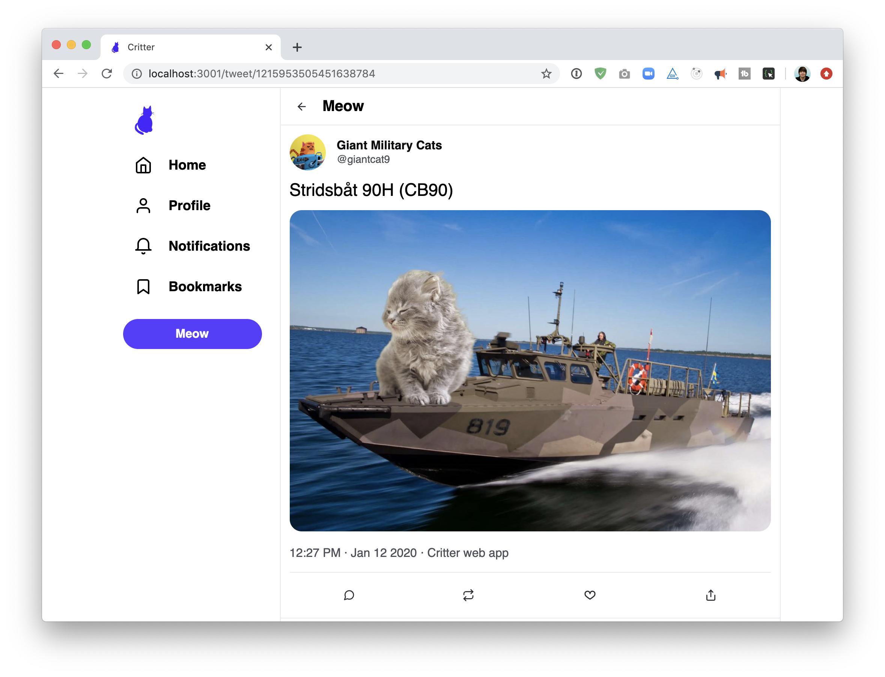

# Twitter-Clone-Project

# Twitter project

This project asks you to create a Twitter clone, "Critter":
---
## Twitter crash course
Twitter is a social network/"micro-blogging" platform. You must be registered to post, but tweets are public and can be seen by non-registered users. Every twitter user chooses a username, often called a "handle". Conventionally, the handle is prefixed with an "@" symbol (eg. `@misswhatever`).

A "tweet" is a post, limited to 280 characters. Tweets can include media like photos or videos. Our clone will have limited media support.

Every profile as a "feed". A feed is a series of tweets. A user's profile feed shows all of the tweets they've posted, plus all of the tweets they've shared.

Users can follow each other. Unlike friends on facebook, following does not require mutual consent.

Every user has a "home feed". The home feed is a list of tweets that have been posted by the people that you follow. If you follow 100 accounts, your home feed will be a stream of tweets from those 100 people, along with things that those 100 people choose to "retweet".

A retweet is a way of sharing a tweet. If I follow `@koolkat`, and Kool Kat really likes Metallica, I may start seeing Metallica tweets in my home feed if Kool Kat retweets them.
---
## Functionality

Your application should include the following features:

### View a single tweet

When the user navigates to `/tweet/:tweetId`, they should see the details for the specified tweet.

> **HINT**: you will need a `fetch` in this component!

---

### View a "home feed"

When navigating to the root URL `/`, the user should see a list of tweets from the accounts that the current user follows.

> **HINT**: you will need a `fetch` in this component!

---

### View a profile page

When navigating to `/:profileId`, information about that user is displayed, above a list of that user's tweets (and retweets):

> **HINT**: you will need two `fetch`es in this component!

---

### Liking a tweet

When clicking the "like" button, it should increment the # of likes. Clicking again should "unlike" the tweet.

> **HINT**: You do not need a `fetch` for this functionality unless you are doing a stretch goal.

---

### Posting a new tweet

On the homepage, the user should be able to create a new tweet by writing in the box and clicking "Meow":

It should show up in the feed below after posting.

> **HINT**: you will need a `fetch` method [POST](https://developer.mozilla.org/en-US/docs/Web/API/Fetch_API/Using_Fetch#uploading_json_data) in this component! 

---
